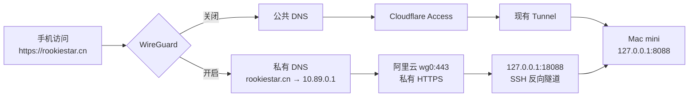

# `/podcasts` 性能专项与上海私网中继总结

日期：2026-08-09

最后复核：2026-08-12

范围：播客列表首次加载、封面交付、滚动稳定性、公网长尾、上海私网入口

状态：应用优化已发布；上海私网入口已可用；Cloudflare 公网绝对时延仍未解决

> 2026-08-12 资源预算口径修订（本地生产模式已验收，生产发布需另行验证）：
> 历史巡检中的“约 2.3MB 静态资源”来自未压缩
> `HEAD Content-Length` 累加，不等于浏览器实际传输。当前严格门禁改按编码传输量；
> 源体积仅作提示。`/podcasts` 列表中文标题改用系统字体，阅读场景继续使用文楷；
> Newsreader 改为只含字重轴的文件，纸张纹理由 1254px / 289KB 压缩为
> 627px / 约 22KB。新冷载预算为 `<900KB`，热回访预算为 `<50KB`。

## 1. 最终结论

本专项解决了应用自身的三个确定性问题：

1. 首帧不再从白底逐步变成米白，慢请求下也不会误显空库。
2. 首批节目与关键封面进入服务器 HTML，不再等待客户端水合才开始加载。
3. 封面尺寸、缓存、并发队列、滚动提级、返回复用和误预取均已收敛。

但“公网访问仍感觉慢”不是错觉。最终版本发布后，认证公网仍出现 16–20 秒首屏长尾，最差一次完整加载约 49 秒；同期生产回环约 25ms。证据表明主要剩余瓶颈位于中国大陆客户端到 Cloudflare 美国西海岸边缘及 Tunnel 的跨境链路，而非后端查询、封面尺寸或缓存失效。

上海中继 A/B 证明了这一判断：同一应用经上海私网路径访问，页面 P50/P95 为 236/278ms，冷态首屏 10 张封面在 664–962ms 内完成。最终已建立同域名双路径：

- WireGuard 关闭：`https://rookiestar.cn` 继续走 Cloudflare Access。
- WireGuard 开启：同一 URL 经私有 DNS 和上海阿里云中继访问 Mac mini。

因此，本专项不能表述为“公共网站性能已彻底解决”；准确口径是：

- 应用侧优化已交付并发布。
- 个人桌面、手机的上海私网快线已交付并验收。
- 公共 Cloudflare 路径仍有跨境长尾；综合验收已按可用性门禁关闭，但这不代表公共路径绝对时延已经解决。

## 2. 目标与体验不变量

专项最初关注：

1. 首次加载时白底逐步变成米白，放大“站点很慢”的感受。
2. 已有缓存预算时，当前屏封面仍有明显逐张下载感。
3. 滚动到后续页面时，新封面的加载速度不稳定。

实施过程中保持以下不变量：

- 不减少首屏有效内容，不用空白换取更快响应。
- 正常、慢、失败、首次访问均保留可理解的页面状态。
- 分页失败保留已加载内容，封面失败收敛到稳定占位。
- 热回访复用浏览器缓存，不重复下载。
- 滚动和返回不误触详情预取，不重复请求已加载封面。
- 私网方案不接管手机其他业务流量。
- Cloudflare Access、现有 Tunnel、FlyingBird 和公共 DNS 保持可用。
- 阿里云不开放公网 Web 端口；私网故障时失败关闭。

## 3. 问题拆分与当前状态

本专项最终压缩为四张粗粒度票：

| Issue | 范围 | 当前状态 | 说明 |
| --- | --- | --- | --- |
| [#79](https://github.com/rookiestar/MagicPodcast/issues/79) | 首次加载感知 | 已关闭 | 首帧米白、稳定加载态、服务器首批数据 |
| [#80](https://github.com/rookiestar/MagicPodcast/issues/80) | 缩略图交付 | 已关闭 | 尺寸桶、缓存路径、错误不缓存 |
| [#81](https://github.com/rookiestar/MagicPodcast/issues/81) | 滚动封面稳定性 | 已关闭 | 生产功能、缓存复用、失败率和预取行为验收完成 |
| [#82](https://github.com/rookiestar/MagicPodcast/issues/82) | 公网综合验收 | 已关闭 | 30 分钟可用性门禁通过；公共绝对时延仍作为已知限制 |

公网长尾已由 [#64](https://github.com/rookiestar/MagicPodcast/issues/64) 跟踪和验证，本轮没有创建重复基础设施 Issue。

以上状态于 2026-08-10 从 GitHub 实时复核。

## 4. 初始生产根因

初始诊断版本为 `7cd8cc6`。

### 4.1 背景不是单纯“图片慢”

- 页面先显示白/灰加载层，再切换到米白。
- 最终视觉依赖约 1.9 MiB 的背景纹理；当时响应为 `no-store`，Cloudflare 为 `BYPASS`。
- 慢链路下，用户先看到白底，再等待纹理逐步盖上去。
- 慢请求还会短暂误显“还没有订阅任何节目”。

因此，首帧问题同时包含底色、加载状态和大资源关键路径，而不只是纹理压缩。

### 4.2 首屏封面尺寸不是首要矛盾

- 15 张封面已是 512px AVIF，总计约 202 KiB。
- 列表请求在导航后约 3.66s 才启动，约 5.72s 返回。
- 首行封面约 7.5s 出现，15 张最慢约 9s。
- 热回访封面传输为 0，证明浏览器缓存有效。

真正问题是请求启动太晚、图片边缘路径未命中，以及封面必须等待客户端状态和水合。

### 4.3 滚动不稳定包含调度错误

- 后续页面封面 P95 约为 2.0s、4.38s、2.95s。
- 后端原图缓存与 Nginx 派生图缓存均为 HIT，但 Cloudflare 为 `DYNAMIC`。
- 纯滚动会误触约 3 个详情预取，与分页和封面争用链路。
- overscan 中的封面先以 low 优先级入队，真正进入视口时没有再次提级，反而被后挂载的新页封面插队。

单图公网长尾会放大问题，但无法解释错误的请求启动顺序；根因是“链路长尾 + 客户端调度错误”叠加。

## 5. 应用侧实施

### 5.1 发布链

| Commit | 作用 |
| --- | --- |
| `145547f` | 建立性能专项工作手册与验收模板 |
| `92a910d` | 统一首帧、缩略图路径和发布构建保护 |
| `2ffe487` | 引入封面共享队列、有限并发、滚动预取抑制和缓存复用 |
| `19370cb` | 保证加载布局和页面首帧直接使用暖米白 |
| `a3195c1` | 服务器直出首批节目，客户端接管后继续分页 |
| `7adca45` | 用预载区和真实视口双观察器修复封面提级 |
| `72e51fc` | 字体/纹理退出首屏关键路径；关键封面不等待水合 |

最终交付：

- PR：[GitHub #83](https://github.com/rookiestar/MagicPodcast/pull/83)
- 合并提交：`2941a0351f915a1c7f3540266b3cd68a0f5bf14f`
- 生产 release：`20260809T114543Z-2941a03-60126`
- frontend build：`ZYb_u-9xGl_7dGQLCnOrw`
- schema：15，未执行迁移
- 当时回退版本：`20260809T103123Z-7adca45-53812`

该版本随后由只调整字体契约并补充本总结的提交 `588e0b632559ff2b8d08f27947c950f298836f02` 继承；其直接父提交即 `2941a03`，未改背景、纹理延后、SSR、封面、分页或缓存路径。

2026-08-10 最终复核时，生产运行：

- release：`20260809T161627Z-588e0b6-81443`
- frontend build：`lhJy0ZGr_wWCl76jkSTNy`
- schema：15
- 回退指针：`20260809T114543Z-2941a03-60126`

生产 `/health`、`/ready` 和数据库状态均正常。

### 5.2 首帧和加载状态

- 暖米白底色由首帧 CSS 直接提供，不依赖纹理下载。
- 加载布局与真实页面使用同一首帧背景。
- 首次请求未完成时显示稳定骨架，不提前展示空库。
- Web 字体加载前使用系统字体回退；字体完成后再恢复正式排版。
- 装饰纹理延后到关键封面稳定后启用。

这不是永久取消字体和纹理，而是改变优先级：

```text
暖底色、文字、首批卡片、关键封面
→ 页面可用
→ Web 字体与装饰纹理
```

首次完整下载后，字体和纹理仍可走浏览器缓存；逻辑仍保持“核心内容优先”，避免缓存失效时重新阻塞首屏。

### 5.3 首批内容和封面

- 服务器获取首批节目并直接写入 HTML。
- 首屏 10 张封面元素存在于服务器 HTML。
- 其中前 5 张为高优先级，其余首屏封面保持受控加载。
- 客户端水合后复用首批数据，再继续完整列表与分页。
- 首屏封面因此能在 JavaScript 水合完成前开始请求。

### 5.4 封面交付和缓存

- 生产图片优化路径固定为 `/_next/image.webp`。
- 当前视口使用 512px 候选，避免回退到过大图片。
- 封面使用稳定缓存键和共享队列。
- 并发上限保持 4，不以提高并发掩盖错误排序。
- 失败只有限重试，最终显示稳定占位。
- 非 200 响应使用 `no-store`，避免本地或 Cloudflare 缓存错误。

#80 生产证据：

- 冷态首屏 10/10 为 512px。
- 边缘预热后 10/10 Cloudflare HIT、10/10 本地 HIT。
- 热回访 15/15 来自浏览器缓存，网络传输 0B。
- 认证公网 400 连续两次均为 `BYPASS/MISS`。
- 定向 4 个测试文件、17 项测试及类型检查通过。

### 5.5 滚动与返回

- 一个观察器负责 360px 预载区，另一个负责真实视口。
- 封面进入真实视口时立即升级队列优先级。
- 新页封面不能再插队压住当前屏已有封面。
- 纯滚动不再触发节目详情预取。
- 返回列表恢复滚动位置，已加载封面不重复下载。

受控浏览器验收：

- 桌面封面进入视口后约 10ms 启动。
- 390px 移动端约 4ms 启动。
- 滚动无详情预取。
- 返回列表封面零重复下载。
- Lint、构建、类型检查、93 个测试文件 / 461 项测试通过。

最终 PR 的完整验证为 95 个前端测试文件 / 472 项测试，并通过类型、Lint、构建、Go vet 与仓库验证脚本。

## 6. 为什么代码优化后体感仍不明显

更严格的生产冷态测试揭示了第二层瓶颈：

| 指标 | 结果 |
| --- | --- |
| 首屏封面 P50 / P95 | 15.3s / 30.2s |
| 滚动新屏 P50 / P95 | 2.15s / 18.58s |
| 封面失败 / 重复下载 / 详情预取 | 0 / 0 / 0 |
| 冷态首屏资源 | 约 1.52 MiB |
| 字体 | 约 879 KiB |
| 纹理 | 约 290 KiB |
| 封面 | 约 56 KiB |
| 应用脚本齐备 | 约 14.9s |

三轮阻断字体与纹理的可逆对照中，首屏封面 P50 从约 15.3s 降到约 5.7s，证明资源竞争和水合依赖确实存在。因此最终采用“字体/纹理退出首屏关键路径 + 首屏封面不等待水合”。

但最终版本发布后，认证公网仍出现 16–20 秒首屏长尾，最差一次完整加载约 49 秒；同期生产回环约 25ms。这说明：

- 应用优化消除了应用自身的等待和错误调度。
- 应用无法消除请求在到达应用前后的跨境网络等待。
- 缓存 HIT 只能避免回源和重复传输，不能保证客户端到边缘的低时延。
- “单张图很小”“后端 1ms”“Cloudflare HIT”均不能单独证明公网用户会快。

## 7. 公网链路诊断

同一时段的分层证据：

| 层级 | 结果 | 含义 |
| --- | --- | --- |
| 生产回环 Nginx / API | 约 1–3ms | 后端查询不是主因 |
| 最终版本生产回环页面 | 约 25ms | 应用本机响应正常 |
| 认证公网列表 API | 10/10 200；P50 约 1.42s；P95/最大约 3.97s | 公网已有明显长尾 |
| Cloudflare Access 直接 302 | 20/20；P50 约 1.3s；P95 约 3.0s；最大 3.4s | 不进入 Tunnel 也慢 |
| Access 边缘 | SJC；站点也曾命中 SEA | 客户端未稳定命中亚洲边缘 |
| Mac mini Tunnel | 4 条 QUIC 连接位于 LAX；RTT 约 197–207ms | 回源继续跨境 |
| QUIC / HTTP/2 A/B | QUIC 略优，但两者 P95 均大于 2s | 切协议不能解决根因 |

通用 Cloudflare 测试曾命中 SIN，但 `rookiestar.cn` 常落在 SJC/SEA；普通套餐无法固定亚洲 POP。最终判断是：

> 公网长尾主要位于中国大陆客户端到 Cloudflare 边缘及跨境 Tunnel 路径，不是 DNS、后端、图片大小或缓存链路的单点回归。

本轮没有重复手机热点实验；已有对照已证明手机热点明显慢于以太网，且不改变上述根因判断。

## 8. 上海中继 A/B

第一阶段桌面拓扑：

```text
浏览器 127.0.0.1:18089
→ 本机 SSH 正向转发
→ 上海 VPS 127.0.0.1:18088
→ Mac mini SSH 反向隧道
→ Mac mini 127.0.0.1:8088
```

结果：

| 场景 | 结果 |
| --- | --- |
| 页面请求 | P50 236ms，P95 278ms |
| 冷态 FCP | 248–440ms |
| 冷态首屏 10 张封面 | 664–962ms 全部完成 |
| 热态 | FCP 108ms；封面 393ms；传输 0 |
| 连续滚动到第 6 页 | 每屏封面 500ms 内完成；失败 0 |
| 同期 Cloudflare 页面 | 1.83–3.74s |

并发启动两套冷浏览器时曾出现一次 2.8s 封面长尾；单用户串行复测未复现。因此该结果证明路径方向正确，但不能当作多用户容量结论。

桌面中继安全边界：

- 两端 Web 中继端口只监听回环。
- 使用独立受限 SSH 账号和密钥，密钥不能打开 Shell。
- 隧道断开时私有入口失败关闭。
- Cloudflare、FlyingBird 和生产服务不受影响。
- Mac mini 与本机均由用户级 `launchd` 自动拉起。

相关 LaunchAgent：

- Mac mini：`/Users/rookiestar/Library/LaunchAgents/cn.rookiestar.magicpodcast-relay-origin.plist`
- 本机：`/Users/bytedance/Library/LaunchAgents/cn.rookiestar.magicpodcast-relay-client.plist`

两者是用户登录后自启，不是未登录状态下的系统级开机自启。

## 9. 手机同域名双路径

### 9.1 最终架构



### 9.2 路由和 DNS

- 手机 `AllowedIPs=10.89.0.1/32`。
- 仅到阿里云 WireGuard 地址的业务流量进入 VPN。
- iOS WireGuard 开启时，DNS 通常交给 `10.89.0.1`；这不等于全局业务流量进入 VPN。
- 私有 DNS 只覆盖 apex `rookiestar.cn`，TTL 为 5 秒。
- 子域名和其他域名继续转发到公共解析器。
- 公共 DNS 记录未改，WireGuard 关闭后自动回到 Cloudflare。

### 9.3 HTTPS 与公网边界

- HSTS 要求私有入口也使用浏览器信任的正式证书。
- 证书由 Let's Encrypt DNS-01 签发，不使用仅 Cloudflare 信任的 Origin Certificate。
- HTTPS 只监听 `10.89.0.1:443`。
- 阿里云公网只新增 WireGuard `UDP 51820`。
- 阿里云公网 443 没有新增暴露。
- Cloudflare DNS Token 仅具有 `rookiestar.cn` DNS 写权限，文件为 `root:root`、权限 `600`。
- 多余临时 Token 已撤销；本机临时凭据和剪贴板已清理。

### 9.4 阿里云配置清单

| 路径 | 作用 |
| --- | --- |
| `/etc/wireguard/wg0.conf` | WireGuard 服务端 |
| `/etc/magicpodcast-private/dnsmasq.conf` | 私有 DNS |
| `/etc/magicpodcast-private/nginx.conf` | 仅 wg0 的 HTTPS 反代 |
| `/etc/systemd/system/magicpodcast-private.socket` | 私网代理 socket |
| `/etc/systemd/system/magicpodcast-private.service` | socket 激活的代理 |
| `/etc/systemd/system/magicpodcast-private-dns.service` | 私有 DNS |
| `/etc/systemd/system/magicpodcast-private-https.service` | 私有 Nginx |
| `/etc/letsencrypt/secrets/cloudflare.ini` | DNS-01 最小权限凭据 |
| `/etc/letsencrypt/live/rookiestar.cn/` | 正式证书 |

2026-08-09 只读复核：

- `wg-quick@wg0`、私有 DNS、socket、HTTPS、证书续期 timer 均为 active/enabled。
- DNS 只监听 `10.89.0.1:53`。
- HTTPS 只监听 `10.89.0.1:443`。
- 反向隧道只监听 `127.0.0.1:18088`。
- WireGuard 监听 `UDP 51820`。
- 证书当前有效期至 2026-11-07；`certbot renew --dry-run` 已通过。

## 10. 最终验收证据

| 验收面 | 结果 |
| --- | --- |
| 生产版本 | release `20260809T161627Z-588e0b6-81443`、frontend build `lhJy0ZGr_wWCl76jkSTNy` 健康 |
| 回退版本 | release `20260809T114543Z-2941a03-60126`、frontend build `ZYb_u-9xGl_7dGQLCnOrw` |
| 私网页面 | `/podcasts` 200 |
| 私网 API | 返回 10 项 |
| 私网首屏封面 | 实际 10 张优化封面全部 200；约 52–300ms |
| 服务重启 | 服务栈重启后私网 `/podcasts` 仍为 200 |
| 故障关闭 | 私网 200 → 断反向隧道后 502 → 恢复后 200 |
| 公网回退 | 私网故障时 Cloudflare 公共入口仍返回 Access 302 |
| 公网暴露 | 阿里云公网 443 直连超时 |
| 手机私有 DNS | `rookiestar.cn → 10.89.0.1` |
| 手机页面 | 私网 `/podcasts` 200；单次约 49ms |
| 手机流量 | WireGuard 约 70.89 KiB 接收、2.05 MiB 发送 |
| 其他网站 | 百度正常，业务流量未进入 VPN |
| 公共入口 | 仍为 Cloudflare Access；单次约 2.17s |
| 公网持续门禁 | 30 分钟、16 个时间点；页面/API 各 16/16 为 200，0 超时、499、5xx |

49ms 和 2.17s 都是单次手机样本，不能当作长期 P50/P95。

公网持续门禁中，页面 P50 为 1828ms、P95/最大为 11632ms；API P50 为 1035ms、P95/最大为 11632ms。Tunnel 总请求与 200 同增 59，错误计数、cloudflared 日志和 Nginx error 日志均无新增异常。这证明候选版本在窗口内可用，不证明公共路径已经明显变快。

当前 release 的额外冷态浏览器复验因 Chrome 控制连接中断未完成；首帧、慢网、纹理阻断、封面失败、移动端和滚动证据来自其直接父提交 `2941a03`。`588e0b6` 的差异核对确认未触碰这些加载路径，且 30 分钟门禁和最终健康检查实际覆盖当前 release。

## 11. 日常使用

### 手机

私网快线：

1. 打开 WireGuard 中的 MagicPodcast 隧道。
2. 直接访问 `https://rookiestar.cn/podcasts`。
3. 无需更换域名、端口或绕过证书警告。

公共回退：

1. 关闭 WireGuard。
2. 重新打开 `https://rookiestar.cn/podcasts`。
3. 页面自动走公共 DNS → Cloudflare Access。

### 当前电脑

桌面回环入口仍可用：

```text
http://127.0.0.1:18089/podcasts
```

该入口仅供本机使用，不应改为公网监听。

## 12. 日常检查

阿里云：

```bash
sudo systemctl status \
  wg-quick@wg0 \
  magicpodcast-private.socket \
  magicpodcast-private-dns.service \
  magicpodcast-private-https.service \
  certbot-renew.timer

sudo ss -lntup
sudo wg show wg0
dig @10.89.0.1 rookiestar.cn
curl --resolve rookiestar.cn:443:10.89.0.1 \
  https://rookiestar.cn/health
```

Mac mini：

```bash
launchctl print \
  gui/$(id -u)/cn.rookiestar.magicpodcast-relay-origin

curl http://127.0.0.1:8088/health
```

当前电脑：

```bash
launchctl print \
  gui/$(id -u)/cn.rookiestar.magicpodcast-relay-client

curl http://127.0.0.1:18089/health
```

检查时不要输出 `/etc/wireguard/wg0.conf` 私钥或 `/etc/letsencrypt/secrets/cloudflare.ini` 内容。

## 13. 故障排查

### 13.1 WireGuard 已握手，但仍出现 Cloudflare 登录页

本次真实故障就是这一类：

- 服务端可见 WireGuard 握手。
- 45 秒抓包没有任何私网 DNS/HTTPS 流量。
- 百度正常。

根因是 iOS 隧道缺少或未启用：

```text
DNS = 10.89.0.1
```

处理：

1. 在 iOS WireGuard 编辑隧道。
2. DNS 设置为 `10.89.0.1`。
3. `AllowedIPs` 保持 `10.89.0.1/32`。
4. 保存后关闭并重新开启隧道。
5. 用 Safari 新标签页打开目标 URL。

百度正常不是故障，反而证明其他业务流量没有被全局接管。

### 13.2 私网返回 502

含义：阿里云 HTTPS 和 WireGuard 正常，但到 Mac mini 的反向隧道或源站不可用。

检查顺序：

1. Mac mini `/health`。
2. Mac mini `launchd` 反向隧道。
3. 阿里云 `127.0.0.1:18088` 监听。
4. 阿里云私网代理服务。

临时恢复访问时，直接关闭手机 WireGuard，使用 Cloudflare 公共路径。

### 13.3 证书警告

不要点击绕过。检查：

- 手机时间是否正确。
- 当前证书有效期。
- `certbot-renew.timer` 是否 active。
- 最近一次续期日志和私有 Nginx 是否已重载。

### 13.4 其他网站也被 VPN 接管

检查手机配置。`AllowedIPs` 必须保持：

```text
10.89.0.1/32
```

不要改成 `0.0.0.0/0`。

### 13.5 私网也重新变慢

分层检查：

1. Mac mini 回环 `/health` 与 `/podcasts`。
2. 阿里云到 `127.0.0.1:18088`。
3. 手机到 `10.89.0.1` 的 WireGuard 流量。
4. 页面、API、封面分别计时。
5. 冷态和热态分开，至少采集多轮 P50/P95。

不要再次用单次请求、缓存 HIT 或后端 1ms 推断整页体验，也不要重复已完成的 QUIC/HTTP/2 A/B。

## 14. 回退

### 14.1 最快、最低风险回退

手机关闭 WireGuard，即刻恢复：

```text
公共 DNS → Cloudflare Access → Tunnel → Mac mini
```

这不需要修改 DNS、Cloudflare 或应用。

### 14.2 停用阿里云私网入口

先停服务，不删除配置：

```bash
sudo systemctl disable --now magicpodcast-private-https.service
sudo systemctl disable --now magicpodcast-private-dns.service
sudo systemctl disable --now magicpodcast-private.socket
sudo systemctl stop magicpodcast-private.service
sudo systemctl disable --now wg-quick@wg0.service
```

确认不再使用后，再关闭唯一新增的公网入口：

```bash
sudo firewall-cmd --permanent \
  --zone=public \
  --remove-port=51820/udp
sudo firewall-cmd --reload
```

不要直接删除 WireGuard、证书、Token、systemd 文件或 SSH 密钥。完整移除前应先核对备份、引用和当前登录通道。

### 14.3 停用桌面本地入口

先用 `launchctl bootout` 停止对应用户级 LaunchAgent，再确认端口消失。不要在未核对密钥和 `authorized_keys` 限制项时直接删文件。

## 15. 已知限制与后续边界

1. **Mac mini 仍是源站。** 上海节点只是私有入口和中继；Mac mini、反向隧道或家庭网络不可用时，私网入口会失败。
2. **公共路径仍慢。** 应用优化不能保证 Cloudflare 美国西海岸路径的绝对时延。
3. **私网增加了依赖。** 手机访问依赖 WireGuard、阿里云、私有 DNS、证书和反向隧道。
4. **当前证书有效期是时间点事实。** 续期 timer 与 DNS-01 Token 需要持续维护。
5. **DNS Token 没有自动到期。** 虽然已限制到单域 DNS 写权限，仍应定期轮换。
6. **桌面 LaunchAgent 只在用户登录后启动。** 尚未做未登录开机自启，也未做整机重启验收。
7. **容量证据有限。** 上海中继主要按单用户串行场景验收；一次双冷浏览器并发曾出现 2.8s 长尾。
8. **手机 49ms 是单次样本。** 需要长期使用数据才能形成可靠 P50/P95。
9. **不建议把完整生产直接迁到当前 VPS。** 2026-08-09 评估时，该机约 2 核、1.8GB 内存且磁盘余量不足；完整迁移建议至少 2 核 4GB、80GB，并单独设计 Linux systemd、备份、SQLite 停写切换和回退。
10. **备案边界取决于公网服务。** 当前 Web 端口不对阿里云公网开放；若未来用大陆 VPS 直接提供公网网站，应按当时的阿里云与监管要求重新确认 ICP 备案。

## 16. 后续建议

短期：

- 保持当前双路径，实际使用一段时间。
- 定期检查证书续期、WireGuard 握手、反向隧道和生产 `/health`。
- 为私网和公共路径分别积累冷态、热态 P50/P95，不混合统计。

Issue 收口：

- #79、#80、#81、#82 均已关闭。
- #82 的关闭依据是功能、缓存、失败路径和 30 分钟可用性门禁，不是公共绝对时延达标。
- 公共跨境绝对时延如继续治理，应以基础设施路径为对象，不再重复修改已验证的封面队列。

长期：

- 若目标是摆脱 Mac mini，再评估独立上海 ECS 的完整生产迁移。
- 迁移必须单独处理容量、备案、Linux 运维、备份、数据库停写切换、灰度和回退，不能把“中继有效”直接等同于“整站迁移安全”。

## 17. 相关文档

- [性能专项工作手册](PERFORMANCE_PLAYBOOK.md)
- [性能专项验收模板](PERFORMANCE_ACCEPTANCE_TEMPLATE.md)
- [性能测试指南](../PERFORMANCE_TESTING_GUIDE.md)
- [公共链路 Tunnel / DNS Runbook](../runbooks/PUBLIC_LINK_TUNNEL_DNS_2026-08.md)
- [发布检查清单](../RELEASE_CHECKLIST.md)
