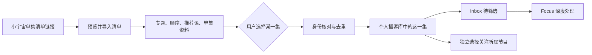

# 播客单集清单设计方案

日期：2026-09-12。状态：讨论草案，已收敛为 [Spec #375](https://github.com/rookiestar/MagicPodcast/issues/375)；最终产品行为与文案以 [本地 Spec](../specs/EPISODE_COLLECTIONS_SPEC.md) 为准。产品尚未实施。

## 1. 结论

将清单作为独立的发现入口：导入的是专题、原始顺序、推荐语与单集资料；用户选中的单集才进入个人播客库。收录一集不意味着关注所属节目，也不意味着抓取该节目的其他单集。

已确认：仅支持单集清单；第一版粘贴指定小宇宙链接导入；按需收录；手动刷新并展示变化，已收录内容保留；选中单集默认收录并加入 Inbox。

默认主操作“加入 Inbox”一次完成收录和待筛选。直接进入 Focus 不作为默认，因为既有自动加工规则可能开始消耗资源。第一版不增加“仅收录”按钮，保持入口简单；收录与队列在领域和服务层仍是两个动作。

最小方案包括清单导入、完整浏览、按需收录、身份去重、手动更新以及既有同步隔离。自动发现、定时更新清单、自建清单、节目型清单、分享发布、批量加工和清单报告均不在第一版。

## 2. 已核实的现状

### 2.1 仓库事实

核对对象为当前本地工作区，基线提交 `c299f68`，包含用户已有改动；不是生产运行状态证明。

| 事实 | 设计影响 | 源码或合同 |
| --- | --- | --- |
| 已接受“发现候选与个人播客库分离” | 外部清单应延续这一边界 | [ADR 0003](../adr/0003-separate-discovery-candidates-from-personal-library.md)、[领域词汇](../../CONTEXT.md) |
| 工作流可选择指定节目、全部订阅、自定义 RSS | “所有来源只能来自关注”不是代码限制；个人实例实际配置本次未查询 | [executor.go](../../backend/internal/workflow/executor.go)，getTargetPodcasts |
| Discovery 按订阅节目过滤，最近时间来自 fetched_at/created_at | 不能直接复用这个接口展示库外清单；导入也不能伪装成工作流最近更新 | [discovery_service.go](../../backend/internal/services/discovery_service.go)，GetCandidate/listRecentCandidateEpisodes |
| 节目列表与个人搜索没有统一的订阅过滤 | 将全部清单单集写入现有表后设未订阅，仍会污染个人库 | [podcast.go](../../backend/internal/handlers/podcast.go)、[search_fts.go](../../backend/internal/services/search_fts.go) |
| 行动队列显式写入；自动加工选择 Focus | 清单收藏、收录、行动选择必须分别处理 | [consumption_service.go](../../backend/internal/services/consumption_service.go)、[scheduler.go](../../backend/internal/processing/scheduler.go) |
| 日报按成功同步的节目取时间窗内单集，不限本次新增 | 清单导入的已关注节目单集可能意外进入报告 | [report_generator.go](../../backend/internal/workflow/report_generator.go)，collectMatchedEpisodes |
| 单集 GUID 全局唯一；已有跨源匹配要求严格 | 小宇宙 eid 不能简单替代 RSS GUID | [episode.go](../../backend/internal/models/episode.go)、[episode_identity.go](../../backend/internal/sync/episode_identity.go) |

### 2.2 用户提供的真实样例

来源：[穿透半导体迷雾](https://www.xiaoyuzhoufm.com/collection/episode/6a20323b78a52c96d821a769)。2026-09-12 通过只读 HTTP 请求得到 200，页面内嵌结构化数据包含：

- 清单 ID、标题、简介、作者昵称“小宇宙领航员”、创建时间与背景图。
- `targetType=EPISODE`，本次返回 8 条，8 个不同 eid，包含顺序、pid、单集和节目标题、逐集推荐语、时长、发布时间、Show Notes、音频链接。
- 第一条为《E185 芯片规律 × AI浪潮｜永庆对话中芯国际联合创始人谢志峰》，推荐语为“存储芯片为何五年内持续短缺？”。

这些字段足以支撑此样例的清单预览，不必先订阅八档节目或逐档抓取 RSS。推荐语应显示为源清单作者的表述，不写成 MagicPodcast 的事实判断或 AI 总结。

证据限制：仅验证这个链接当前返回的内容；没有独立总数或分页完成标记，不能据此保证其他清单完整性。未验证音频实际播放、其他页面格式、付费条目、登录态或长期接口稳定性。页面数据不是承诺稳定的官方 OpenAPI，也不能从匿名响应里的 subscriptionStatus 推断用户本人关注状态。

## 3. 领域模型与操作边界

| 概念 | 含义 |
| --- | --- |
| 单集清单 | 围绕主题组织、有顺序且带策展说明的一组单集引用 |
| 清单条目 | 某一集在某份清单中的位置、推荐语与外部身份；同一集可以属于多份清单 |
| 导入清单 | 保存源清单的可浏览副本；不代表把所有条目加入个人播客库 |
| 收录单集 | 用户明确选择后，建立或复用个人库中的单集及必要的所属节目记录 |
| 节目关注 | 沿用现有订阅语义，影响“全部订阅”等抓取范围；不随单集收录自动发生 |
| 清单刷新 | 用户主动读取源清单的新内容、展示增删与重排，不改变已作出的个人行动选择 |

图中 Inbox 为用户已确认的默认；Focus 继续使用既有加工资格与调度规则。导入、预览和刷新均不执行模型、转写或全节目抓取。

## 4. 页面与完整用户流程

### 4.1 入口

在发现区增加“清单”入口，与“最近更新”和工作流报告并列。清单保留专题整体，不把所有条目打散混入最近更新。

- `/collections`：已导入清单，显示标题、来源、条目数、已收录数、最近成功刷新时间；支持按清单标题查找。
- `/collections/:id`：完整清单、原始顺序与推荐语；`?item=:itemID` 定位具体条目，刷新、复制链接、返回可恢复位置。
- 第一版清单内部支持“全部 / 未收录 / 已收录”，默认全部，保留原序号。不按个人评分或热度重排。
- 库外条目在清单详情中浏览。已入库条目复用现有单集详情入口，不把尚未落地的 `/episodes/:id` 路由作为前置依赖。

参考当前 [URL 体系草案](../archive/planning/URL_SYSTEM_PROPOSAL_2026-09-12.md)，但该草案不是已实现事实。清单地址只读取，不在打开时自动导入、入库或加工。

### 4.2 导入

1. 粘贴链接，点击“预览”。服务器识别清单 ID，读取清单本身，不抓整档节目。
2. 展示标题、作者、来源、抓取时间、条目与推荐语；说明“导入清单不会关注节目或自动加工”。可核实总数时显示总数；不能核实时显示“已读取 N 集”，不宣称全量。
3. 用户点击“导入清单”，保存当前可见的预览版本；确认时不能悄然换成另一个更新后的内容版本。重复链接进入已有清单，不新建副本，也不自动刷新覆盖。
4. 有明确未加载的分页或解析不完整时，不允许以“完整导入”提交；展示实际已读取范围及阻塞原因。第一版无需提供复杂的残缺清单编辑器。

### 4.3 浏览与收录

每条展示封面、单集标题、节目、时长、发布日期、清单推荐语、收录/队列状态，以及“打开原文”。推荐语和 Show Notes 分区展示，来源缺失时不生成替代推荐语。

库外条目可先查看清单已有简介和 Show Notes。首次选中时才按需补充这集的最新必要资料；音频不可用仍可保存合法的公开元数据，但必须标明不能播放或加工。

主按钮“加入 Inbox”：先完成身份解析，再在同一数据库事务内复用/建立单集、关联清单条目、放入 Inbox。任何一步失败，都不能显示为全部成功。第一版以该组合操作作为唯一采纳入口。

已有单集直接关联已有 ID；已有 Focus、Someday、Done 或不感兴趣状态保持原状，显示“已在 Focus”“已完成”等。不能用一次重复收录把 Done 送回 Inbox；重新处理沿用既有显式操作。

所属节目尚不存在时，建立用于归属的节目记录，明确未关注，列表显示“未关注 · 已收录 1 集”；不假称已同步全节目。源站总集数与本地已收录数分开呈现。

### 4.4 刷新与删除

点击“刷新清单”后，完整读取源数据，在提交前展示“新增 N、移出 N、顺序/推荐语变化”。推荐一次确认后原子替换当前清单内容；没有变化只更新检查时间。

- 新增条目仍是库外引用，不自动收录。
- 源站移出的条目不再出现在当前清单，但已收录单集、笔记、队列和产物保留。
- 已采纳条目的来源记录保留清单 ID、标题、原 URL、采纳时间；移出后仍可解释“当初从哪里发现”。未采纳且移出的旧元数据无需永久保留。
- 刷新不覆盖个人备注、评分、队列或清单来源之外的个人数据。
- 删除本地清单只删除清单及其未采纳资料，不删除已经收录的单集，不取消节目关注；采纳来源保留简短文本记录即可，不做无限版本历史。
- 用户从个人库删除单集后，清单关联解除并显示未收录；清单刷新不得自动重新收录。

## 5. 抓取与同步的分工

| 用户动作 | 获取/保存的内容 | 不触发的动作 |
| --- | --- | --- |
| 预览链接 | 一份清单所需元数据 | 全节目 RSS 同步、下载全部音频、模型调用 |
| 导入清单 | 清单与外部条目 | 个人库批量写入、关注节目、队列变化 |
| 收录一集 | 指定单集与必要节目归属 | 抓取其他单集、自动关注 |
| 刷新清单 | 清单的新版本与变更预览 | 自动收录新增条目、重置个人选择 |
| 关注节目/加入工作流 | 用户明确选择的既有同步范围 | 不在清单导入中隐式执行 |
| 加入 Focus | 既有加工路径和调度规则 | 不引入第二套清单加工器 |

第一版优先使用清单已返回的数据与指定单集页面。收录不调用整档 `SyncPodcastEpisodes`，也不通过填造 RSS URL 绕过现有模型约束。读取公开 RSS 用于核对单集身份时，只采纳被选中的那一集；不能顺便写入其他 RSS 条目。

新节目以明确的数据库写入保留 `is_subscribed=false`，须测试持久化回读，避免当前 GORM `default:true` 覆盖零值的风险。已有节目保持原关注状态。第一版不另造自动同步开关；“全部订阅”继续沿用已有筛选。对用户主动选择未关注节目做单节目同步或加入指定节目工作流，界面明确提示将扩展到整档范围；这属于后续独立动作。

还必须补上一个单集级边界：新清单收录的单集，在尚未被普通同步实际识别前，不具备“工作流最近更新”和日报候选资格，即便父节目已关注。建议增加最小的 `collection_only` 标识：既有单集默认 false，清单新建单集设 true，普通同步真正匹配到该单集时清除；仅解析 RSS 做身份核对不清除。最近更新和报告查询排除 true；个人搜索、节目详情和显式 Focus 仍可使用已收录单集。已有单集从清单再次收录不改变这一标识或抓取时间。

这个标识解决已核实的查询泄漏，不充当第二套个人库账本，也不按“来源是小宇宙”推断订阅或加工资格。普通同步遇到已收录单集后的时间字段仍遵守已有“新增/实质更新”规则，不能为获得曝光而刷新时间。

## 6. 最小数据与服务设计

不建立全网节目目录，不为未来平台提前设计插件体系。沿用 Go 服务、SQLite、现有队列和同步模块。

| 存储 | 最少职责与关键约束 |
| --- | --- |
| `episode_collections` | 源清单 ID/URL、标题、简介、作者、导入时间、最近成功刷新时间、当前修订号；source + external_id 唯一 |
| `episode_collection_items` | 所属清单、顺序、eid/pid、推荐语、必要元数据快照、可空的本地 episode_id；同一清单 + eid 唯一；关联删除个人单集时置空 |
| `episode_external_refs` | 已收录单集的外部身份到本地 ID 的映射，第一版仅需小宇宙；source + external_episode_id 唯一，校验所属节目一致 |
| `episode_collection_adoptions` | 单集被采纳的清单来源摘要；每集每清单一条，包含原 ID/URL、标题与采纳时间；删除清单不删除该摘要，删除单集按既有删除规则清理 |
| 既有 Episode | 新增上述 `collection_only`；不复制评分、备注、Done、加工状态 |

清单条目的快照只是发现资料，不是第二份可加工 Episode。队列、个人备注、音频加工和知识产物永远引用既有本地 episode_id。

缺失 RSS 的新节目需要处理现有 FeedURL 唯一索引：多个空字符串会冲突。建议未知 FeedURL 存 NULL，保留非空 URL 的唯一性；迁移与 JSON 输出需定向兼容既有接口。不能发明一个假的订阅地址填入。节目身份优先用真实 pid；遇到现存 RSS 节目缺 pid 时，需核对可靠 Feed/节目身份后复用，不能仅按标题创建或合并。

### 6.1 去重与事务

1. 优先命中已有外部引用、已核实的小宇宙单集原链接；旧数据没有统一外部引用时按已验证的链接/来源信息按需补齐，不做全库盲回填。
2. 核对同一节目及 RSS 身份。复用现有严格匹配规则，但有多候选或明显冲突时保留“待确认”并列出候选，不能按标题或音频临时签名地址猜测。
3. 无已有集且身份足够时才新建。获得真实 RSS GUID 则沿用；无法获得时可使用明确命名空间的外部键作为暂存身份，但后续 RSS 同步必须先查外部映射再决定创建。仅给 GUID 加前缀不构成跨来源去重方案。
4. 源站 ID、节目身份和 RSS 无法建立可靠对应时，暂停该条收录或要求用户确认候选；清单浏览仍可用。后续新增 Feed 时也需同一规则，不能先创建重复集再批量合并。
5. 网络解析在事务外完成；落库、外部引用、采纳来源和Inbox 写入在事务内完成。并发收录依靠唯一约束与事务重读复用，不重复入队、不覆盖现有队列状态。
6. 软删除数据不自动复活；反馈已删除冲突并走明确恢复/重新收录决策。保留已有跨节目 GUID 冲突的拒绝行为。

### 6.2 服务与 API 草案

- 一个小宇宙清单读取模块负责 URL 识别、公开页面抓取、结构化解析，输出标准清单和条目；不写个人库。
- 一个清单服务负责预览、保存、刷新、差异和来源；收录方法调用既有个人单集与队列能力。
- 在现有同步的身份解析入口复用外部引用匹配，避免“清单知道是同一集，RSS 又创建一集”。

建议接口：`POST /collections/preview`、`POST /collections`、`GET /collections`、`GET /collections/:id`、`POST /collections/:id/refresh-preview`、`POST /collections/:id/apply-refresh`、`POST /collections/:id/items/:itemID/adopt`、`DELETE /collections/:id`，均置于现有 `/api/v1` 与认证边界内。

预览以服务端短期保存的待提交结果绑定，返回预览 ID；不信任客户端回传的外部 HTML、任意音频地址或身份结论。刷新提交同时校验当前修订号，避免两个页面相互覆盖。保存只接受用户看过的那份预览；过期时明确要求重新预览。无需引入独立通用任务平台。

## 7. 获取失败、边界与界面结果

对当前小宇宙 collection/episode 格式做窄支持。允许公开页面数据的确定性解析，不靠 LLM 猜清单成员、补标题或推荐语。HTTP 200 但结构缺失也视为解析失败。

导入 URL 仅允许经过核实的小宇宙主机和清单路径；限制重定向并逐跳校验，阻止访问本机/私网。沿用项目已有 HTTP 边界，检查缺口后只补必要的地址、响应大小和解析限制。Show Notes 使用现有安全渲染。来源内容不能作为 Agent 指令执行。

| 场景 | 用户可见结果 |
| --- | --- |
| 正常 | 预览显示实际清单；导入后立即浏览；收录结果展示真实本地状态 |
| 慢请求 | 清单刷新保留原有内容和操作；预览显示正在读取，可取消；单条收录只锁该条操作 |
| 请求失败 | 保留上一份成功清单；区分网络失败、来源不可用、格式不支持、身份冲突，并提供对应重试或原文入口 |
| 首次访问 | 无清单时说明如何导入；未获取过的链接失败时显示失败，不伪装为空清单或推荐替代条目 |

第一版页面读取本地保存的清单，不在打开时请求小宇宙。刷新是显式操作，因此无需新增自动刷新或复杂缓存策略；展示“上次成功获取时间”，不把它称为源站更新时间。

403、登录要求、付费或下架不绕过，停止重复无效获取。条目仍可保留合法公开标题与原链接，但不能把音频地址存在当作可下载、可转写的证明。元数据可浏览与素材可加工分别返回状态。

## 8. 实施顺序与验收

依赖顺序为来源解析 → 清单浏览 → 单集收录及隔离 → 手动更新。不要以界面完成代替跨来源去重和同步边界验收。

| 阶段 | 交付 | 必须通过的验收 |
| --- | --- | --- |
| A：来源验证 | 当前格式解析、代表性样例 Fixture | 指定样例的 8 个 eid、顺序与推荐语一致；长清单/分页、缺字段、受限与格式变化有真实或明确标注的测试证据；不能默认所有网页完整 |
| B：清单浏览 | 链接预览、导入、清单页和条目定位 | 导入/重复导入/刷新页面可用；个人节目、单集、队列、报告不因仅导入清单改变；可由新地址直接访问条目 |
| C：按需收录 | 身份映射、原子收录、既有队列接入 | 8 集里选 1 集最多新增 1 个 Episode；新节目未关注且不抓其他集；已收录/多清单/并发不重复；Done 等不被改写 |
| D：同步兼容 | 后续订阅和 RSS 识别、最近更新及报告隔离 | RSS 后来出现同一集复用同一 ID；无 pid/无 Feed/多候选/跨节目冲突不误并；清单独有集不泄漏到原报告和最近更新，正常同步集维持原行为 |
| E：手动更新 | 差异预览、原子更新、删除边界 | 增删重排和推荐语更新准确；源失败保留原清单；已采纳集/笔记/产物保留；删除清单不删库，删单集不被刷新复活 |

具体测试组合：

- 隔离 SQLite 集成测试：约束、NULL FeedURL、未关注标记回读、事务回滚、并发、软删除、身份冲突与后续 RSS 同步。
- 代表性数据：用户给定 8 集样例；同一集出现在两份清单；父节目已关注但该集未入库；已有 Done 单集；同名不同集；清单无推荐语；缺 RSS；不同节目均无 Feed。
- 真实浏览器：桌面与窄屏导入、查看推荐语/Show Notes、收录、返回、直达、手动刷新和删除。测试正常、慢、失败、首次访问，同时记录响应与有效内容出现时间；清单操作不得拖慢原发现主路径。
- 运行相关后端/前端检查，最后核对现有订阅同步、个人搜索、日报选择与 Focus 调度；验证范围遵循 [日常验证指南](../AGENT_VERIFICATION.md)。

这是未来实施的验收清单，本次没有实现或运行这些功能测试。数据库变更需独立迁移与隔离演练，生产迁移/发布继续单独授权，不由普通启动自动应用。

## 9. 决策记录与后续

用户已确认的五项产品选择是本方案基础；技术细节是可评审的建议，并未登记为 accepted ADR。

建议确认完整方案后，扩展 [CONTEXT.md](../../CONTEXT.md) 中“发现候选池”以容纳单集引用，并把“入库”扩展到单集；沿用 ADR 0003 的分离原则，补充“清单单集采纳不等于整节目订阅”的已批准决定。现有领域文件有任务外改动，本次只新增本草案，避免把尚未确认的建议写成现状。

首版完成的判断应是：用户能够从这份真实清单中保留策展上下文、挑出一集进入既有工作台，同时未选中的七集及所属节目的其他集不会被自动入库或加工。
