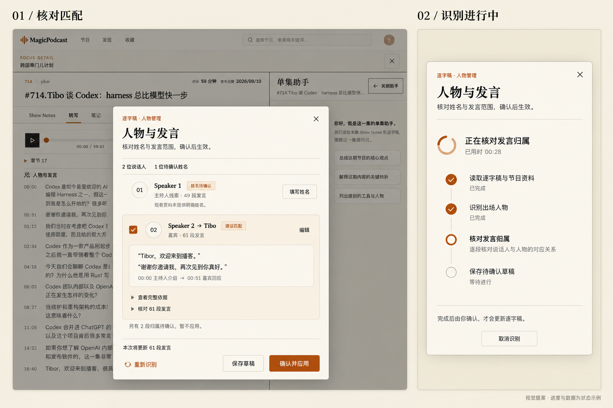

## Problem Statement

“人物与发言”已支持识别、保存草稿、人工确认与单集助手联动，但当前管理面板嵌在逐字稿旁边。当单集助手也打开时，形成三块竞争宽度的内容区域，逐字稿被挤成细长列；姓名表单、证据、匹配范围与保存操作同时展开，视觉层次混乱。

识别目前通过普通请求等待完整结果，只显示笼统的忙碌文案。用户无法判断正在做什么、是否还在运行、是否已保存，也难以区分取消、断线和失败。

本 Spec 是 #346 的视觉与交互后续，不重做已经落地的人物识别领域能力。用户已确认下述高保真原型以及正常、慢请求、失败/断线、首次使用四种 SSE 场景。

## Solution

逐字稿保留原有完整阅读宽度，“人物与发言”只占据播放控制区下方的一条紧凑工具栏。点击入口后，在当前阅读界面上方打开居中管理弹层：先看匹配结论，按需编辑和展开证据，再明确确认影响范围。

识别期间，弹层显示由真实执行阶段驱动的进度与耗时；完成后进入持久草稿的待确认状态。SSE 只改善过程可见性，不降低实际核对要求，不把识别结果自动应用。

### 已确认高保真原型

- 左：居中“人物与发言”弹层，原始 Speaker 与建议姓名并列，未知姓名提供填写入口，证据与发言范围可展开，底部固定确认操作。
- 右：同一个弹层在识别进行中的状态示例；不是另一个常驻栏，也不是要求两个弹层同时出现。
- 色彩延续现有米白纸面、深色正文、细暖灰分隔线与克制橙色强调；桌面弹层约 720px 宽、轻阴影与约 8px 圆角，手机接近全屏，正文与操作区留足空间。
- 原型中的 00:28、人物数、片段数和引文为视觉状态示例，正式界面必须来自当前来源和执行事实。背景中的导航细节不是本次改版范围；文案和业务语义以本 Spec 为准。

### 四种用户场景（已确认）

| 场景 | 用户可见行为 |
| --- | --- |
| 正常 | 点击即有响应；真实阶段持续推进；只有草稿保存成功后才显示识别完成并进入待确认列表。 |
| 慢请求 | 保留现有逐字稿与已应用结果；显示当前阶段、累计耗时和取消入口，连接存活不冒充新进展，无虚构百分比。 |
| 失败或断线 | 保留已保存内容和当前未提交编辑；说明失败或结果尚未确认。先读取服务端持久状态核对是否已保存，再提供适当重试，避免重复执行或覆盖新结果。 |
| 首次使用 | 打开入口只展示说明和已有状态；用户点击“识别人物”才运行。识别无结果时明确提示，并提供手动填写姓名入口。 |

## User Stories

1. As an 逐字稿读者, I want 人物管理不挤压正文宽度, so that 我能舒适阅读长段发言。
2. As an 同时使用单集助手的用户, I want 人物管理出现在居中弹层, so that 不产生第三栏竞争阅读空间。
3. As an 首次使用者, I want 从紧凑工具栏发现识别入口, so that 不必进入 Copilot 找人物管理。
4. As an 回访用户, I want 工具栏概括已应用人物与待核对状态, so that 快速知道本集处理情况。
5. As an 首次使用者, I want 主动开始识别, so that 打开页面或链接不会启动模型或修改归属。
6. As an 核对用户, I want 优先看到“原 Speaker → 建议姓名、角色、片段数”, so that 一眼理解建议。
7. As an 核对用户, I want 未识别的 Speaker 也出现在列表中, so that 不会误以为所有说话人都已覆盖。
8. As an 核对用户, I want 未知姓名明确标为待确认, so that 角色线索不会被伪装成真实人物身份。
9. As an 手动补充用户, I want 点击“填写姓名”进入既有手动匹配流程, so that 不必先成功识别。
10. As an 核对用户, I want 编辑姓名和角色时才展开表单, so that 默认列表保持清爽。
11. As an 核对用户, I want 分开审阅姓名证据和发言归属证据, so that 不把介绍嘉宾的人误认成嘉宾。
12. As an 核对用户, I want 展开完整证据并定位原文时间点, so that 可实际检查匹配依据。
13. As an 核对用户, I want 展开发言范围并看到例外和未匹配数量, so that 不把混合话轮整组确认。
14. As an 审阅用户, I want 只选择本次同意的匹配, so that 可以保留其他疑点继续核对。
15. As an 审阅用户, I want 底部清楚显示本次影响的片段数, so that 明确确认范围。
16. As an 中途离开的用户, I want 单独保存草稿并刷新后恢复, so that 审阅不需要一次完成。
17. As an 谨慎用户, I want 识别或保存草稿不改变正式归属, so that 只有明确应用才更新逐字稿和人物问答。
18. As an 重新识别用户, I want 保留已有人工结果并看到新增建议, so that 不会丢失已完成的核对。
19. As an 等待识别的用户, I want 看到真实执行阶段, so that 知道系统正在处理什么。
20. As an 等待较久的用户, I want 看到耗时、连接状态和取消入口, so that 可以决定继续等待还是停止。
21. As an 等待识别的用户, I want 不看到虚构百分比或模型内部推理, so that 进度表达可信且易读。
22. As an 听播客的用户, I want 收起弹层后继续阅读和播放, so that 识别过程不占用我的全部注意力。
23. As an 返回弹层的用户, I want 同一页面内看到同一次识别的当前状态, so that 不重复发起任务。
24. As an 取消识别的用户, I want 取消后明确知道是否留下已保存草稿, so that 不把取消误解为撤销已完成保存。
25. As an 遇到断线的用户, I want 系统先核对持久结果再提示重试, so that 不因丢失完成事件而重复识别。
26. As an 遇到错误的用户, I want 已有草稿、正式匹配及未提交编辑保持可见, so that 失败不会让我从头开始。
27. As an 多页面用户, I want 迟到事件或旧版本请求不能覆盖新决定, so that 并发操作不会丢失人工修改。
28. As an 手机用户, I want 大尺寸弹层和固定操作区, so that 长姓名、软键盘和证据不会挤出按钮。
29. As an 键盘用户, I want 正确的焦点循环、Esc 和焦点恢复, so that 不误关闭外层阅读页或单集助手。
30. As an 直接纠错用户, I want 保留双击姓名及可见编辑入口, so that 快速纠错不依赖管理弹层中的长流程。
31. As an 单集助手用户, I want 应用后继续 @人物并引用可靠发言, so that 视觉改版不破坏模拟回答。
32. As an 使用来源链接的用户, I want 证据定位保留真实来源版本和片段身份, so that 新旧稿不会错位。
33. As an 查看历史结果的用户, I want 已应用与待确认建议有不同状态, so that 不会重复确认或把旧建议当成新结果。
34. As an 使用辅助技术的用户, I want 阶段状态有可访问名称且不过度播报, so that 进度不会干扰操作。

## Implementation Decisions

### 1. 最小范围与领域合同

- 修改逐字稿人物界面、人物识别 HTTP 传输、识别阶段报告与前端流式消费；复用现有人物身份、人物识别草稿、发言归属、Runtime、SSE、播放器与单集助手能力。
- 保留 #346 的草稿与应用语义、持久化历史、来源版本和 revision 竞争控制。识别完成只代表保存草稿完成；正式姓名展示与模拟回答资格仍需明确应用。
- 不新增数据库 schema、持久任务中心、通用进度平台或第二套草稿账本。运行中进度是临时状态，草稿及已应用结果以现有数据库为准。
- 未匹配 Speaker 可由现有逐字稿标签和发言归属汇总。仅姓名未知不创建虚构人物；只有证据支持时显示“主持人线索”，角色也不确定则只显示“姓名待确认”。
- 不修改人物识别标准、工具权限或外部补搜能力，不能借视觉改版扩大自动绑定范围。

### 2. 弹层与列表

- 移除人物面板与逐字稿并排的布局。管理开启前后正文列宽一致，单集助手的原有布局不受影响。
- 工具栏位于播放控制区下方，展示标题、状态及一个主要入口；未开始、待核对、已应用、新建议并存均有相应文案。
- 弹层覆盖当前页面而非插入正文；居中、限高、内部滚动、底部操作固定。窄屏接近全屏，适配安全区与软键盘。无新增字体包、动画框架或视觉主题。
- 默认按 Speaker 展示摘要。已应用、新建议、未知姓名与局部匹配有明确文字标记，不只依赖颜色。已应用结果不能显示成尚待首次确认。
- 仅主动编辑时展开姓名/角色表单；证据与匹配范围逐层展开。保留既有片段范围调整、角色纠正、解除匹配与历史草稿能力。
- 有效影响数量以所选实际片段去重计算。未勾选、例外、失效来源不计入本次应用；没有有效变更或正在提交时禁用相应按钮。
- 原位双击姓名、触屏可见编辑入口和键盘入口继续可用；保存/确认必须明确范围，失焦不自动应用。

### 3. 关闭、定位与可访问性

- 弹层设置对话框语义、标题关联、焦点循环；打开后聚焦合适控件，关闭后回到触发入口。Esc 只影响最上层交互，不连带关闭 Focus Detail 或 Copilot。
- 关闭弹层不等于应用、取消识别或丢弃编辑。同一页面仍在当前单集时保留审阅状态与进行中的请求，工具栏显示运行状态并可重开。
- 离开单集/卸载页面时取消前端请求并传播取消信号；不承诺跨刷新后台持续运行。刷新后重新读取已保存草稿和已应用结果。
- 未保存编辑不得被静默覆盖；重新识别前须先保存或明确放弃，沿用既有脏状态防护。
- 点击原文定位可收起弹层并准确跳到对应版本片段；再次打开保留审阅上下文。已有音频播放位置保留，普通定位不自动开始播放。
- 对接 #349/#351 的人物工作区域和版本化引用语义：弹层替代原面板的视觉形式，URL 表示工作区域，不表示已经识别或应用。只在导航能力实际落地后对接，不另建平行导航方案，也不凭 Issue 开关状态设置虚构阻塞。
- 减弱动画偏好下保持可理解；阶段变化温和播报，耗时更新不逐秒打断屏幕阅读器。

### 4. SSE 与真实进展

- 人物识别入口使用现有 fetch 流式读取模式承载 POST SSE，复用现有解析器和取消机制。保留其他读取、草稿保存、正式应用接口的职责；若保留普通响应客户端，用内容协商复用同一识别实现，不复制业务流程。
- 对外稳定表达“读取逐字稿与节目资料 → 识别出场人物 → 核对发言归属 → 保存待确认草稿”。进入、完成或失败阶段必须对应实际工作，不能定时轮播。
- 识别服务主动报告阶段边界。Runtime 现有事件可辅助运行状态，但不得把未经核实的模型文本当成匹配结果。若整批核对没有逐段计数，就只显示阶段，不能宣称已核对 N/M 段。
- 展示累计耗时，不提供无依据的百分比或剩余时间预测。长阶段配合轻量运行标识；连接心跳仅证明连接存活，不能称为模型产生新进展。
- 事件类别至少区分阶段、完成、失败与心跳，并能绑定当前单集、来源版本及本次请求。完成携带权威草稿结果/修订信息；数据库提交成功后才发送完成。
- 前端只接纳当前请求的事件；旧请求、旧单集和旧来源的迟到事件被忽略。现有 revision 与来源版本控制继续保护保存和应用，流式状态不绕过这些约束。
- 覆盖端到端代理链路的即时 flush 与禁止缓冲设置；不能只证明后端发出事件，却让 Next 代理或生产代理到结尾才集中返回。
- SSE 输出限于安全的阶段、耗时和结果摘要；不输出模型推理链、提示词、凭据、原始工具日志或与当前识别无关的内容。

### 5. 取消、断线与恢复

- “取消识别”显式发送取消信号，停止接纳旧请求事件，并核对持久状态。取消失败或状态未知如实提示，不能假报已停止。
- 取消发生在草稿提交之前时不生成成功假象；如果草稿已提交但完成事件丢失，重新读取后显示已保存草稿。取消不撤销已经提交的草稿，更不能解除既有应用。
- 失败/断线后先读取现有人物和草稿状态，按来源及 revision 判断是否有新结果；读取失败显示“结果状态尚未确认”，提供重新读取入口，不能直接宣称识别失败或无结果。
- 不自动反复 POST 重启模型。需要重新识别时提供明确重试入口，禁止同页重复点击并行提交；多页面竞争由现有版本控制兜底。
- 遵守现有有限超时与资源限制；心跳不无限延长业务执行。已有内容不因请求慢、断线、取消或重试变成空白。

## Testing Decisions

沿用用户已在 #346 确认的最高层验收入口：**逐字稿识别 → 保存草稿 → 用户确认 → 刷新仍保留 → Copilot @人物引用正确发言**。本次再叠加已确认原型和四种 SSE 场景；不重复访谈，不扩展为识别算法质量专项。

- 好的测试断言用户看到什么、什么时候看到、是否持久化和是否误应用；不以内部 state 名称、CSS 类名或回调次数替代行为证据。
- 优先复用逐字稿人物用户流、播放器定位、单集助手集成测试。HTTP/服务层补充流式事件、取消与草稿提交竞争、来源及 revision 失效测试；SSE 拆包/分包沿用既有解析器测试。
- 受控阶段用于稳定验证慢请求、断线和异常竞争；至少通过一次实际 Runtime 与真实浏览器链路证明事件在结果完成前可见。受控数据不能冒充真实 Runtime 进度证据。
- 测试使用隔离数据和端口；记录当前实现 SHA 与访问入口。原型是视觉验收依据，不能代替实际页面和交互验收。

| 编号 | 验收标准与可观察证据 |
| --- | --- |
| AC1 | 打开/关闭人物弹层时逐字稿正文宽度不变；Copilot 同开不产生第三阅读栏。 |
| AC2 | 桌面约 1133×1354、常规宽屏及 390px 手机尺寸实际检查；长姓名、多人物、展开证据、软键盘下无水平溢出，底部按钮可达。 |
| AC3 | 列表区分已应用、新建议、未知姓名与例外；未知 Speaker 有手动入口，不自动创建“主持人”实体或绑定节目作者。 |
| AC4 | 表单和详细证据按需展开，原文定位与返回正确，显示和提交的选中片段范围及数量一致。 |
| AC5 | 通过普通 UI 编辑、保存草稿、关闭重开、刷新，已保存内容与应用状态可恢复；未保存内容不被静默覆盖。 |
| AC6 | 明确应用前，逐字稿姓名与模拟回答资格不变；应用后，两处共同使用可靠的当前来源发言。原位修改及解除匹配仍有效。 |
| AC7 | 正常识别在最终响应前呈现真实阶段，完成仅在草稿保存之后出现；保存失败不显示成功，事件顺序可核对。 |
| AC8 | 慢请求下已有内容保留，耗时与阶段可见，可取消或收起后继续阅读；不能由心跳伪造工作推进。 |
| AC9 | 首次访问不开启模型；主动识别无结果时说明原因/状态并提供手动填写。 |
| AC10 | 失败及断线保留已有内容，先读回服务端状态；分别覆盖提交前断线、提交后丢失完成事件、状态读取失败和主动重试。 |
| AC11 | 取消传播到后端/Runtime；覆盖取消与提交竞争，不把已保存草稿当成未保存，不误取消其他请求或修改正式归属。 |
| AC12 | 重复点击、多页面较新保存、来源换稿及离开单集后迟到事件不会覆盖当前内容、更新错误单集或误应用。 |
| AC13 | 弹层关闭/重开保留同页进度，离开/刷新读取持久结果；不错误承诺跨页后台任务，不重复启动。 |
| AC14 | 键盘、Esc、焦点恢复和触屏入口可用；只关闭最上层弹层，播放器和助手状态保留；耗时无逐秒辅助技术播报。 |
| AC15 | 浏览器经真实前端代理观察多个阶段早于最终结果；测量点击至首个反馈、首个服务端事件与最终草稿出现时间，确认没有整流缓冲或人为等待。 |
| AC16 | 已有正常逐字稿阅读/播放、草稿历史、人工决定、新旧来源隔离与 Copilot @人物用户流无回归；如 #351 已落地，追加人物入口与来源链接的前进后退恢复检查。 |

收口提供 AC→证据映射、实际浏览器截图、检查命令及结果、测量值与未执行项；不只用 HTTP 200、类型检查、静态原型或合并状态宣称验收通过。

## Out of Scope

- 人物识别算法扩张、自动联网查询原节目主持人、放宽可靠发言归属标准。
- 妙记反写、重跑语音转写、修改原始正文、时间戳、音频或不可变产物。
- 新增任务中心、持久化完整进度事件历史、跨刷新可靠后台执行或分布式任务系统。
- 新增数据库迁移、历史人物结果回填、重做全局人物库或单集助手。
- 全站导航实施与页面大改；#349/#351 独立管理其导航范围。
- 本次 Spec 发布不实施产品代码，不部署、重启、迁移或修改真实人物结果；后续实施与 Git/生产操作遵循项目授权。

## Further Notes

- 用户于本次会话明确确认了非 Figma 高保真原型及上文四种 SSE 场景；原型采用内置 imagegen 生成，属于设计提案而非生产截图。
- 本 Spec 取代 #346 中“宽屏人物面板与逐字稿并排”的视觉决策，其余持久化、用户确认、可靠归属及 Copilot 联动合同继续有效。
- 相关需求：#346（基础能力）、#300（Runtime 活动展示先例）、#349/#351（人物工作区域导航）。不自动关闭这些 Issue，不根据票面状态虚构实现依赖。
- 本次核对远端 main 为 `730dc72f9b3e04000d403feb4031377f9faf6b8e`。该版本人物识别接口返回完整 JSON；Runtime 已有执行订阅，但人物识别未向前端暴露阶段；项目已有 SSE 消费、草稿与完整用户流测试可复用。
- 当前本地工作树基线较旧且存在既有修改。实施应重新核对远端主线，在干净隔离工作区完成，不能直接把旧工作树当成现行实现。
- 原型图保留原始 PNG，随本 Spec 在独立文档分支归档。Issue 使用固定提交链接引用，避免只依赖当前电脑上的临时路径；不合并或修改产品主线。
