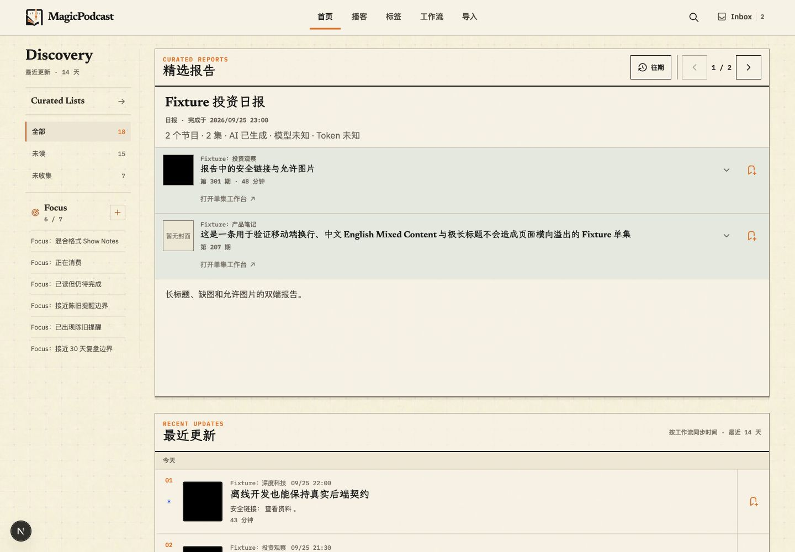
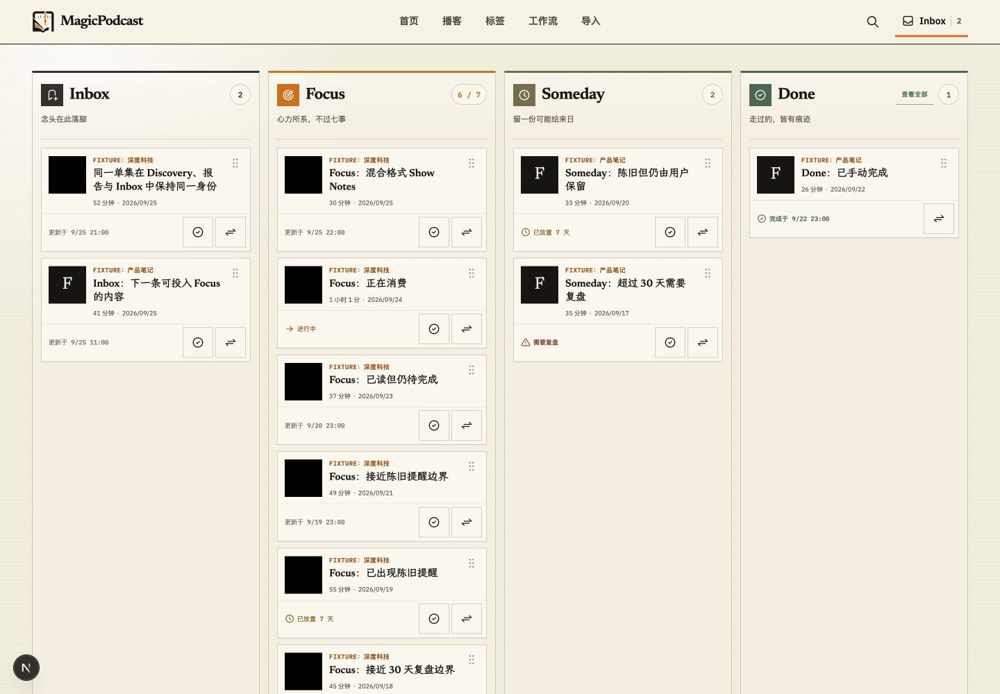
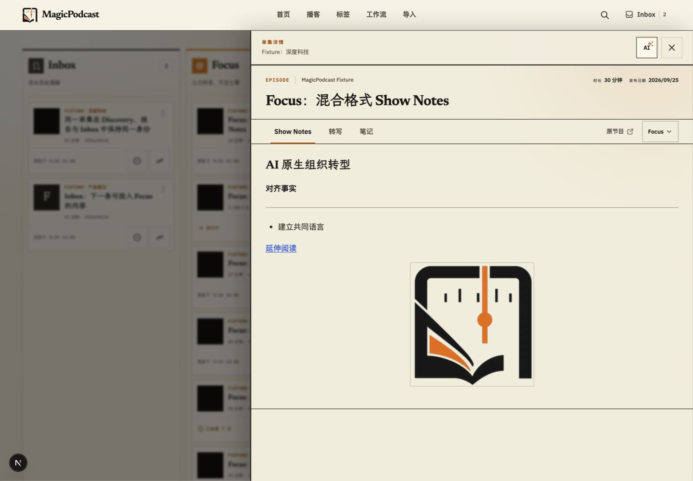
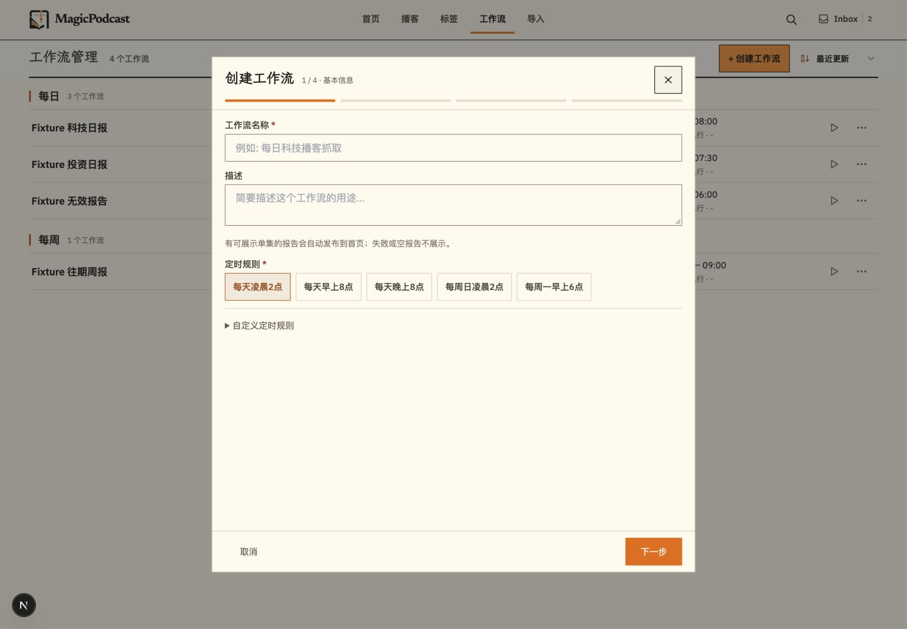
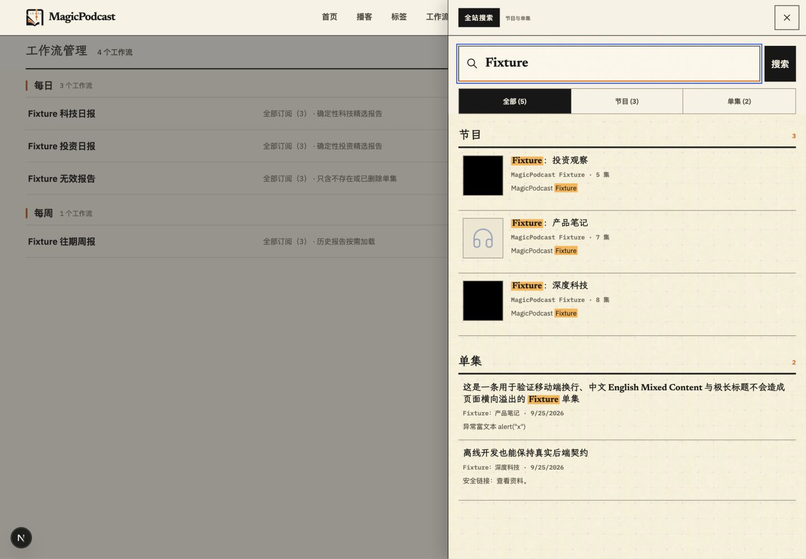
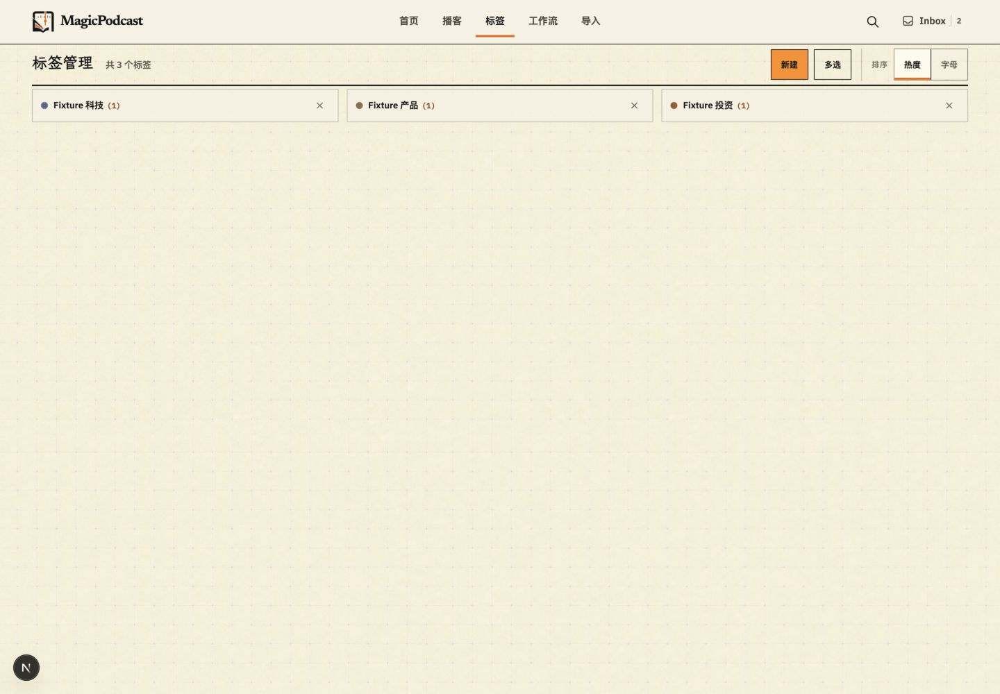
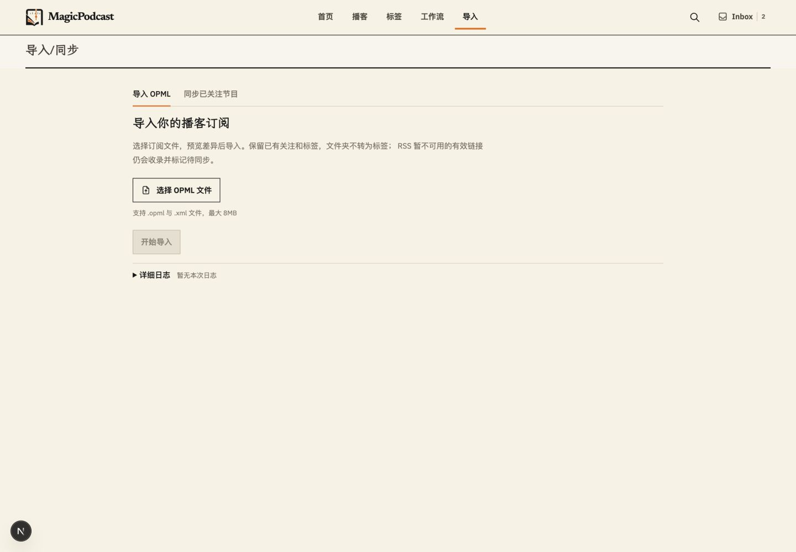
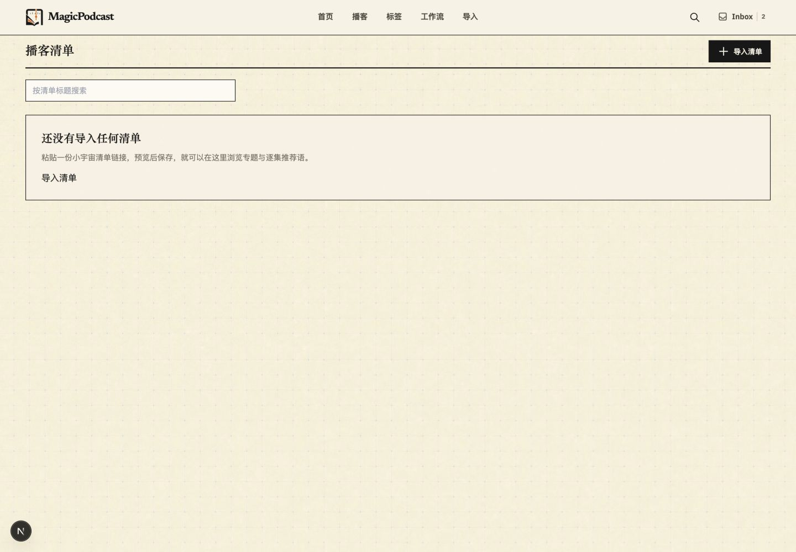
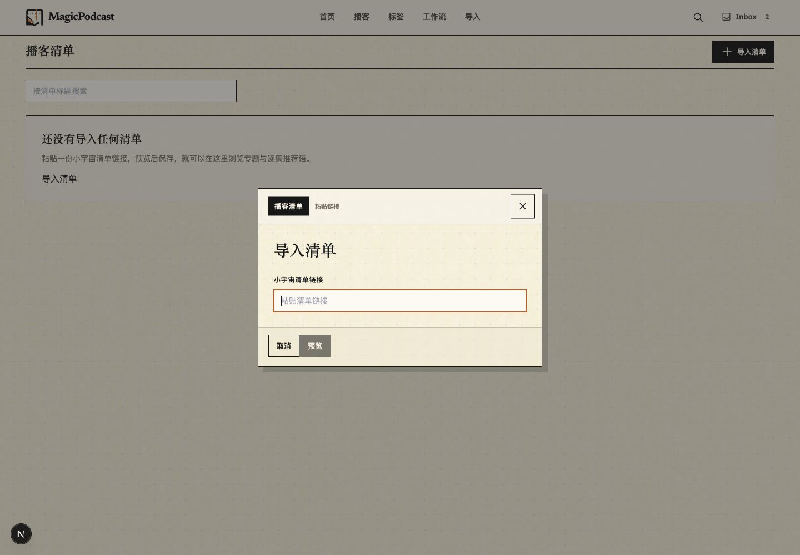

# 前端一致性审查截图
本轮 Fixture 基线与实际操作证据；最终变更见仓库 `docs/design/FRONTEND_CONSISTENCY_2026-09-25.md`。

## 01 首页 · 桌面
结构清楚；纹理、分隔较强，规范与现实风格冲突。

## 02 行动工作台 · 桌面
四栏适合比较；现有完成、移动与拖放模式保留。

## 03 单集工作台 · 桌面
详情关闭、菜单 Escape 已可用；未验收外部加工。

## 04 单集工作台 · 手机
内容与操作可达；阅读页签保持现有结构。

## 05 行动工作台 · 手机
只能看见一栏和下一栏边缘，切换入口不明确；顶部有无效占位。

## 06 首页 · 手机
精选报告默认折叠，最近更新优先；保留现有任务顺序。

## 07 播客列表 · 手机
内容可读；没有将少量测试数据造成的空白视为缺陷。

## 08 节目详情 · 手机
标题、简介、管理区域可用；继续保留分钟级更新时间。

## 09 单集卡片 · 手机
标题去站外，旁边还有工作台、阅读简介、查看详情，目的地不易区分。

## 10 工作流列表
已有紧凑列表，作为管理页面密度参考。

## 11 工作流创建第一步
固定高度让后续步骤不跳动；本轮未覆盖完整创建过程。

## 12 搜索结果与键盘
Shift+Tab 从关闭按钮越出弹层，会意外关闭搜索；已复现。

## 13 标签管理
功能入口清楚；与工作流的背景纹理存在差异。

## 14 导入首页
初始说明和日志入口清楚；本轮未运行实际导入。

## 15 清单空态
导入按钮黑色，与其他管理页橙色主操作不同。

## 16 清单导入弹窗
强硬阴影、较大间距，底部按钮贴左且无间隔。

